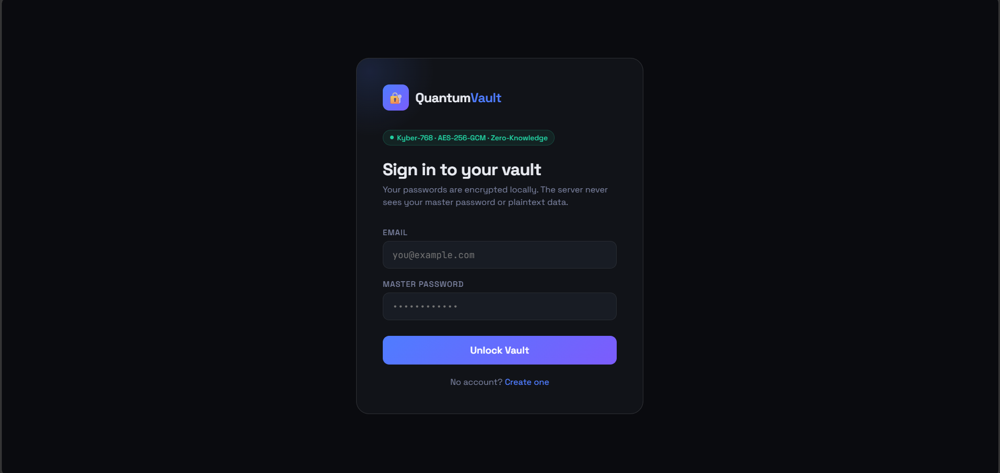
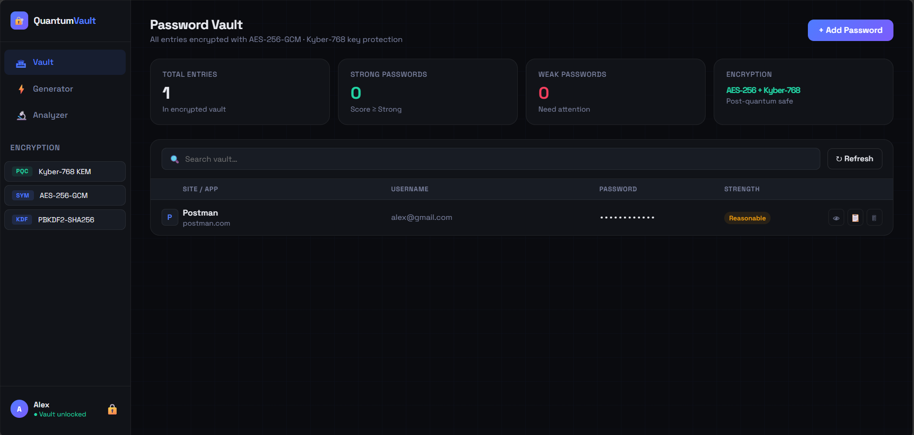
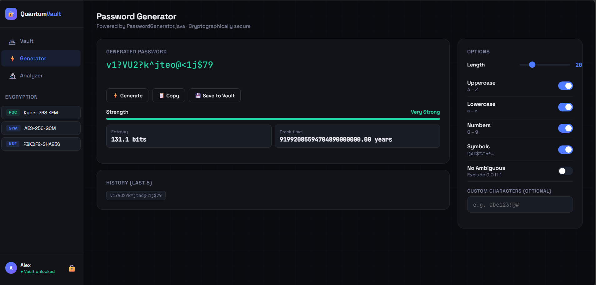
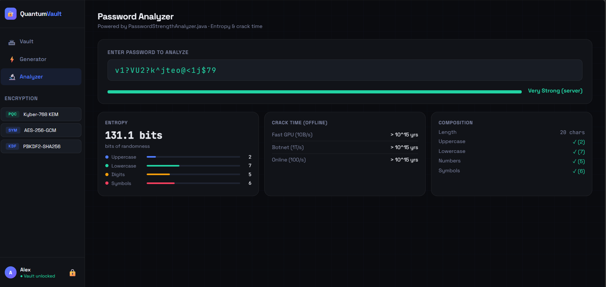

# QuantumVault

QuantumVault is a Spring Boot-based backend for a password manager that stores encrypted vault entries and offers password generation and analysis utilities.

## Overview

QuantumVault is a modern, quantum-safe password manager that encrypts all vault entries using **AES-256-GCM with Kyber-768 post-quantum key protection**. It provides secure password storage, generation, and analysis with end-to-end encryption. All passwords are encrypted locally before transmission, and the server never sees plaintext data.

- **Backend:** Spring Boot 3.5.12
- **Language:** Java 21
- **Persistence:** H2 database (file-based)
- **Security:** Spring Security + JWT authentication + Post-Quantum Cryptography
- **Core Features:**
  - User registration and login with BCrypt password hashing
  - JWT-based authentication
  - Vault entry storage with AES-256-GCM encryption & Kyber-768 key protection
  - Password generation with customizable options
  - Password strength analysis with entropy and crack time estimation
  - H2 console for database inspection

## Application Features

### 1. Secure Login
Users authenticate via email and master password. The password is hashed with BCrypt and never transmitted in plaintext.

### 2. Password Vault
All vault entries are encrypted with **AES-256-GCM** and protected with **Kyber-768** (post-quantum key encapsulation). The server stores only encrypted blobs and key envelopes.

### 3. Password Generator
Generate cryptographically secure passwords with custom options including length, character types (uppercase, lowercase, numbers, symbols), and custom character sets. Shows real-time strength analysis and estimated crack time.

### 4. Password Analyzer
Analyze password strength based on entropy, character composition, and estimated crack time across different attack scenarios (GPU, Botnet, Online).

## Screenshots & UI Showcase

### Login Screen
Clean, intuitive sign-in interface with email and master password fields. Displays the cryptographic algorithms in use: **Kyber-768 + AES-256-GCM + Zero-Knowledge** for maximum security assurance.



### Password Vault Dashboard
Central hub for managing stored passwords. Shows:
- **Total Entries**: Count of encrypted passwords
- **Strong Passwords**: Passwords rated as "Strong" or better
- **Weak Passwords**: Passwords requiring attention
- **Encryption Status**: Real-time display of encryption method (AES-256 + Kyber-768)
- **Password List**: Searchable table with site/app, username, encrypted password, and strength rating



### Password Generator Interface
Powerful password generation tool featuring:
- Real-time generated password display
- Customizable length (slider control)
- Character type toggles (Uppercase, Lowercase, Numbers, Symbols, No Ambiguous)
- Optional custom character set input
- **Strength Meter**: Visual representation of password entropy
- **Metrics Display**: 
  - Entropy in bits
  - Estimated crack time (years) across different attack scenarios
- **History**: Tracks last 5 generated passwords
- **Quick Actions**: Generate, Copy, Save to Vault buttons



### Password Analyzer
Advanced password analysis tool showing:
- Real-time strength evaluation
- **Entropy Calculation**: Bits of randomness
- **Crack Time Estimates**: 
  - Fast GPU (10B/s)
  - Botnet (1T/s)
  - Online Attack (100/s)
- **Composition Breakdown**: Character type distribution with visual bars
- **Rating Label**: From "Weak" to "Very Strong"



## Project Structure

- `src/main/java/com/vault`
  - `QuantumVaultApplication.java` — Spring Boot application entry point
  - `controller/` — REST controllers for authentication, vault operations, and password utilities
  - `service/` — business logic for authentication, vault storage, and password utilities
  - `model/` — JPA entities for `User` and `VaultEntry`
  - `repository/` — Spring Data JPA repositories
  - `security/` — JWT utilities, filter, user details service, and security configuration
  - `PasswordGenerator.java` and `PasswordStrengthAnalyzer.java` — password utility helpers
- `src/main/resources/application.properties` — application configuration
- `pom.xml` — Maven build configuration
- `data/` — H2 database storage directory

## Requirements

- Java 21 JDK
- Maven (or use the bundled Maven wrapper `mvnw` / `mvnw.cmd`)

## Running the Application

From the project root (`quantum-vault/quantum-vault`):

```bash
./mvnw spring-boot:run
```

Or build and run the JAR:

```bash
./mvnw package
java -jar target/quantum-vault-0.0.1-SNAPSHOT.jar
```

The server listens on `http://localhost:8081`.

## Configuration

Key application settings are in `src/main/resources/application.properties`:

- `spring.datasource.url=jdbc:h2:file:./data/quantumvault`
- `spring.h2.console.enabled=true`
- `spring.h2.console.path=/h2-console`
- `app.jwt.secret` — JWT signing secret (replace before production)
- `app.jwt.expiration-ms` — token expiration in milliseconds
- `server.port=8081`

> Note: The provided JWT secret is a placeholder and should be changed for any real deployment.

## API Endpoints

### Authentication

- `POST /api/auth/register`
  - Request body: `{ "email": "...", "name": "...", "passwordHash": "...", "kdfSalt": "..." }`
  - Response: `{ "token": "...", "email": "..." }`

- `POST /api/auth/login`
  - Request body: `{ "email": "...", "passwordHash": "..." }`
  - Response: `{ "token": "...", "email": "..." }`

- `GET /api/auth/salt/{email}`
  - Response: `{ "kdfSalt": "..." }`

### Vault Management

All `/api/vault` endpoints require a valid JWT Authorization header:

```
Authorization: Bearer <token>
```

- `GET /api/vault/entries`
  - Returns stored vault entries for the authenticated user

- `POST /api/vault/entries`
  - Request body: `{ "encryptedBlob": "...", "kyberEk": "..." }`
  - Saves an encrypted vault entry and returns its `id` and `createdAt`

- `DELETE /api/vault/entries/{id}`
  - Deletes the authenticated user's vault entry by ID

### Password Utilities

- `POST /api/password/generate`
  - Request body includes `length`, `uppercase`, `lowercase`, `numbers`, `symbols`, and optional `customCharacters`
  - Response includes generated password, strength label, and estimated crack time

- `POST /api/password/analyze`
  - Request body: `{ "password": "..." }`
  - Response includes strength label and estimated crack time

## Security Behavior

- Password hashes are stored using BCrypt via `PasswordEncoder`
- JWTs are generated by `JwtUtil` and validated by `JwtFilter`
- Authenticated requests are validated by Spring Security
- H2 console is publicly enabled at `/h2-console`
- CORS is configured to allow all origins and standard HTTP methods

## Cryptographic Algorithms

| Purpose | Algorithm | Where |
|---------|-----------|-------|
| Login password | BCrypt (cost 10) | USERS.PASSWORD_HASH |
| Key derivation | PBKDF2-SHA256 | Browser only (600k iterations) |
| Vault encryption | AES-256-GCM | VAULT_ENTRIES.ENCRYPTED_BLOB |
| PQC key protection | Kyber-768 (sim) | VAULT_ENTRIES.KYBER_EK |
| Token signing | HMAC-SHA256 | JWT tokens |

## Data Model

- `User`
  - `email`, `name`, `passwordHash`, `kdfSalt`, `createdAt`

- `VaultEntry`
  - `user`, `encryptedBlob`, `kyberEk`, `createdAt`, `updatedAt`

## Notes

- The backend expects the client to perform encryption before sending vault data. The server stores encrypted blobs and an optional `kyberEk` key envelope.
- The `PasswordGenerator` and `PasswordStrengthAnalyzer` classes provide local password creation and analysis logic.
- The project uses H2 file storage under `data/`, making it suitable for development and testing.

## Frontend Assets

This workspace also contains a separate `Frontend Files/` directory with HTML files such as `decrypt-tool.html` and `QuantumVault.html`. Those frontend files are not part of the backend Maven module.
